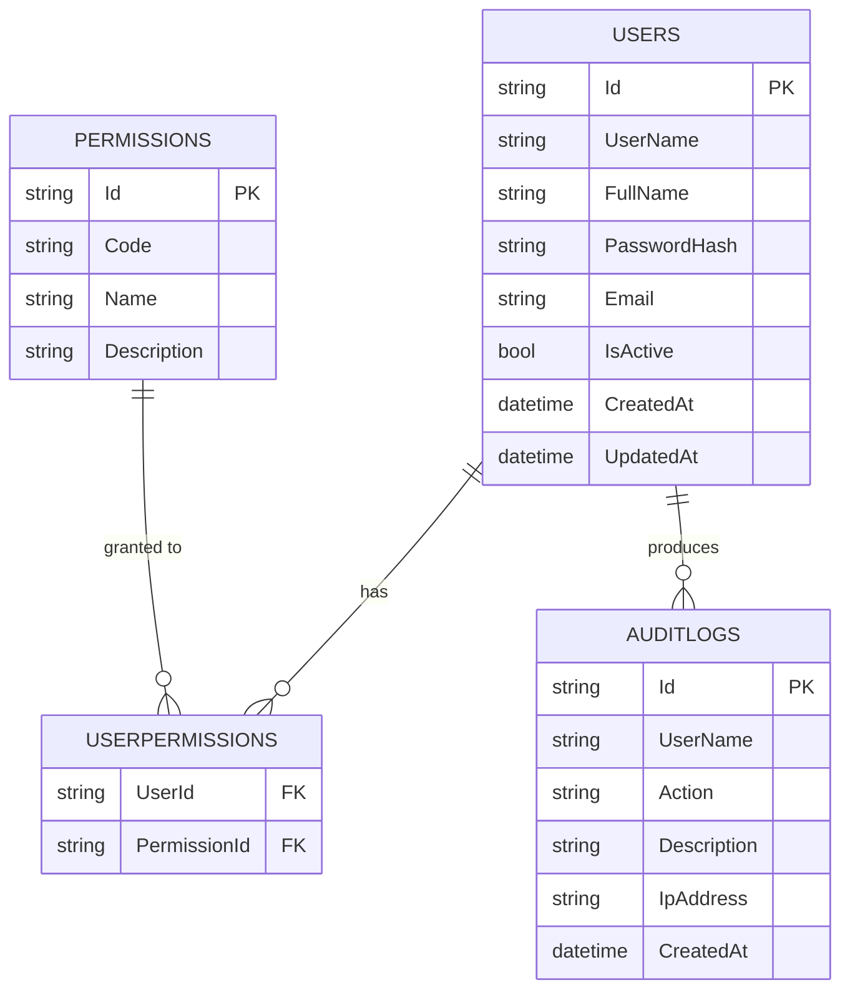

## Sơ đồ ERD

### ERD (Mermaid)

### Ghi chú bảng

- `Users`
  - `IsActive`: khóa đăng nhập khi `false`
  - Chỉ lưu `PasswordHash` (SHA256); không lưu plain password

- `Permissions`
  - `Code` dùng trong claim `Permissions` để kiểm tra quyền

- `UserPermissions`
  - Bảng nối N-N giữa Users và Permissions

- `AuditLogs`
  - Ghi lại hành động (đăng nhập thành công/thất bại, thao tác quản trị)

### Ràng buộc & Indexes (khuyến nghị)

- Unique index: `Users(UserName)`, `Permissions(Code)`
- PK composite: `UserPermissions(UserId, PermissionId)`
- FK: `UserPermissions.UserId -> Users.Id`, `UserPermissions.PermissionId -> Permissions.Id`
- Index thời gian trên `AuditLogs(CreatedAt)` để truy vấn mới nhất

